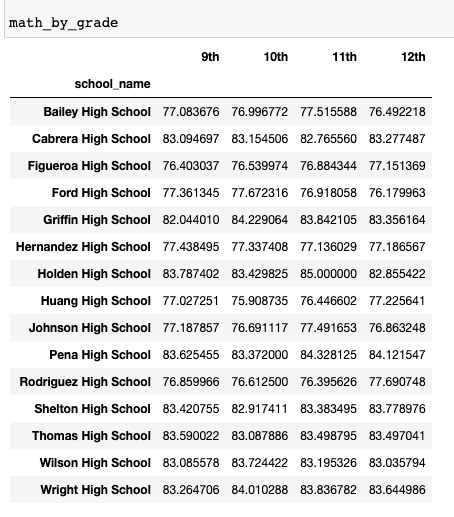
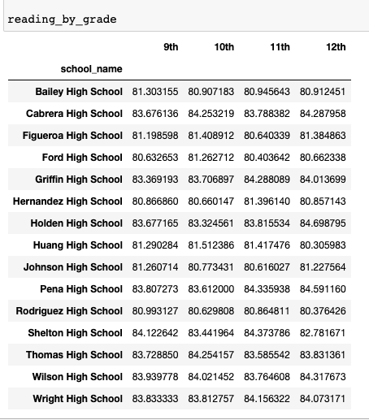

# pandas-challenge
## Manipulating Pandas DataFrames to analyse a particular city's school and standardised test data.

# PyCity Schools Analysis

I've analysed the district-wide standardised test results for a city's schools using Pandas Dataframes and Pyhton 3. The dataset used contains every student's math and reading scores, as well as various information on the schools they attend. I aggregated the data to showcase obvious trends in school performance.

# School Tests Data Analysis Report

### Observed trends: 

According to the results of **Scores by School Spending** and the **Scores by School Size**, the top performing schools have some of the lowest number of total students and some of lowest per student budget. Smaller schools with smaller per student budgets perform better in comparison with bigger schools with greater per student budgets.

Looking at the **Scores by School Type**, the 5 **Top Performing Schools** by Overall Passing % and the 5 **Bottom Performing Schools** by Overall Passing % , all 5 bottom schools are **District** schools, whereas all 5 top performing schools are **Charter** schools.

And lastly from the result on the **Reading and Math Scores by Grade**, the average reading grade fluctuates at around 1% difference between the 9th-12th grade in all schools. When comparing schools against each other there is a bigger variance than comparing different grades in the same schools which seems to be consistent in all schools.

# Steps Taken:

### District Summary

A DataFrame that summarizes key metrics about each school district. With the following metrics:
* Total schools
* Total students
* Total budget
* Average math score
* Average reading score
* % passing math (the percentage of students who passed math)
* % passing reading (the percentage of students who passed reading)
* % overall passing (the percentage of students who passed math AND reading)

### School Summary

A DataFrame that summarizes key metrics about each school. With the following metrics:

* School name
* School type
* Total students
* Total school budget
* Per student budget
* Average math score
* Average reading score
* % passing math (the percentage of students who passed math)
* % passing reading (the percentage of students who passed reading)
* % overall passing (the percentage of students who passed math AND reading)

### Highest-Performing Schools (by % Overall Passing)

A DataFrame that highlights the top 5 performing schools based on % Overall Passing. With the following metrics:

* School name
* School type
* Total students
* Total school budget
* Per student budget
* Average math score
* Average reading score
* % passing math (the percentage of students who passed math)
* % passing reading (the percentage of students who passed reading)
* % overall passing (the percentage of students who passed math AND reading)

### Lowest-Performing Schools (by % Overall Passing)

A DataFrame that highlights the bottom 5 performing schools based on % Overall Passing. With the following metrics:

* School name
* School type
* Total students
* Total school budget
* Per student budget
* Average math score
* Average reading score
* % passing math (the percentage of students who passed math)
* % passing reading (the percentage of students who passed reading)
* % overall passing (the percentage of students who passed math AND reading)

### Math and Reading Scores by Grade
DataFrames that list the average math and the average reading score for students of each grade level (9th, 10th, 11th, 12th) at each school.
<table>
  <tr>
    <td>Math Scores By Grade Level</td>
     <td>Reading Scores by Grade Level</td>
  </tr>
  <tr>
    <td></td>
    <td></td>
  </tr>
 </table>

### Scores by School Spending
School performance based on average spending ranges (per student). I created four bins with reasonable cutoff values to group school spending. With the following metrics:

* Average math score
* Average reading score
* % passing math (the percentage of students who passed math)
* % passing reading (the percentage of students who passed reading)
* % overall passing (the percentage of students who passed math AND reading)

### Scores by School Size
School performance based on school size (small, medium, or large).

### Scores by School Type
School performance based on type of school (district or charter).

